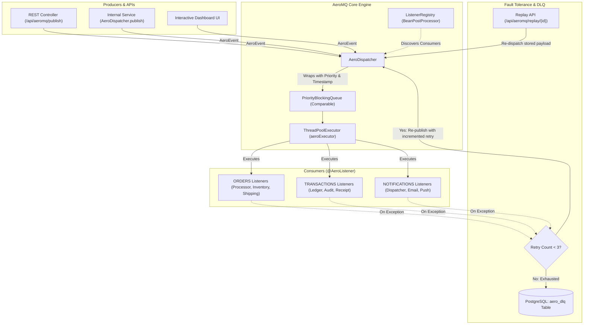

# ⚡ AeroMQ

> A lightweight, asynchronous, priority-based in-memory message broker and task queue engine for modern Spring Boot and Java 21 applications.

[](https://www.oracle.com/java/)
[](https://spring.io/projects/spring-boot)
[](LICENSE)
[](https://www.postgresql.org/)
[]()

---

## 📌 Repository Description

**GitHub About Tagline:**
```text
A lightweight, priority-driven in-memory message broker & task queue engine for Spring Boot 3 & Java 21 with automatic retries, DLQ persistence, and live dashboard.
```

**Recommended GitHub Topics / Tags:**
`java21` • `spring-boot` • `message-broker` • `task-queue` • `priority-queue` • `event-driven` • `pub-sub` • `dead-letter-queue` • `dashboard` • `concurrency`

---

## 📖 Overview

**AeroMQ** bridges the gap between basic in-memory executors and heavyweight external message brokers (like RabbitMQ, Apache Kafka, or AWS SQS). Built for high-throughput, low-latency microservices and modular monoliths, AeroMQ gives you:

- **Annotation-driven event listeners** (`@AeroListener`) with zero boilerplate.
- **Strict priority-based execution** backed by an in-memory `PriorityBlockingQueue` and custom `PriorityRunnable`.
- **Fan-out publish/subscribe** architecture across multiple concurrent subscribers.
- **Enterprise-grade fault tolerance** with automated retry policies (`MAX_RETRIES = 3`).
- **Dead Letter Queue (DLQ) persistence** powered by Spring Data JPA & PostgreSQL.
- **Replayability** to re-inject failed DLQ messages back into active worker queues.
- **Real-Time Control Center Dashboard** built into the broker with live metrics, quick-dispatch triggers, and interactive demo scenarios.

---

## 🏗️ Architecture



---

## ✨ Key Features

| Feature | Description |
| :--- | :--- |
| **🎯 Priority Scheduling** | Events carry an explicit priority level (`1` = highest). Tasks are executed strictly in priority order, with sub-millisecond timestamp ordering serving as a deterministic FIFO tie-breaker. |
| **⚡ Non-Blocking Asynchronous Core** | Backed by a high-performance `ThreadPoolExecutor` utilizing a lock-free `PriorityBlockingQueue` for maximum concurrency. |
| **🔍 Seamless Consumer Discovery** | Simply annotate any Spring component method with `@AeroListener(topic = "...")`. AeroMQ dynamically indexes consumers at startup via Spring's `BeanPostProcessor`. |
| **📢 Topic Fan-Out (Pub/Sub)** | A single published event automatically fans out concurrently to all consumers registered to that topic. |
| **🛡️ Automatic Retries & DLQ** | Transient failures automatically retry up to 3 times. Exhausted failures are cleanly serialized to JSON and persisted into the `aero_dlq` table. |
| **🔁 DLQ Event Replay** | Re-drive dead-lettered messages directly back into the broker queue via REST or from the dashboard with one click. |
| **📊 Live Web Control Center** | Built-in dark-themed dashboard providing real-time telemetry (queue depth, active worker threads, completed task counter, and DLQ tracking). |
| **🧪 Interactive Demo Suite** | One-click triggers for **Priority Order Verification**, **Burst Ingestion**, and **DLQ Failure/Recovery** simulations. |

---

## 🛠️ Tech Stack

- **Language:** Java 21 (LTS)
- **Framework:** Spring Boot 3.5.x
- **Data Persistence:** Spring Data JPA / Hibernate
- **Database:** PostgreSQL (Neon Cloud / Local) & In-Memory H2 (Test suite)
- **JSON Serialization:** Jackson (`ObjectMapper`)
- **Dashboard Frontend:** HTML5, Tailwind CSS, FontAwesome 6, Vanilla JS

---

## 🚀 Getting Started

### Prerequisites

- **Java Development Kit (JDK):** Version 21 or higher
- **Maven:** 3.9+ (or use the included `./mvnw` wrapper)
- **Database:** PostgreSQL instance running, or configure an alternate database in `application.properties`

### 1. Clone the Repository

```bash
git clone https://github.com/Adit10076/AeroMQ.git
cd AeroMQ
```

### 2. Configure Database & Thread Pool

Edit `src/main/resources/application.properties` to configure your PostgreSQL credentials and worker pool:

```properties
spring.application.name=broker

# Worker pool size:
# Set to 1 to visually verify priority ordering sequentially in logs.
# Set to 0 or leave unset to default to Runtime.getRuntime().availableProcessors().
aeromq.executor.pool-size=1

# PostgreSQL Configuration
spring.datasource.url=jdbc:postgresql://<your-db-host>/<database>?sslmode=require
spring.datasource.username=<your-username>
spring.datasource.password=<your-password>
spring.jpa.hibernate.ddl-auto=update
spring.jpa.open-in-view=false
```

> **Note on Testing:** The test suite (`src/test/resources/application.properties`) automatically runs against an embedded **H2 in-memory database**, requiring zero external setup for `mvn test`.

### 3. Build & Run

Run the application using the Maven wrapper:

```bash
# Windows
mvnw.cmd spring-boot:run

# Linux / macOS
./mvnw spring-boot:run
```

Once started, the server listens on **`http://localhost:8080`**.

---

## 🖥️ Live Control Center Dashboard

Open your browser and navigate to:

👉 **[http://localhost:8080](http://localhost:8080)**

The AeroMQ Control Center provides:

1. **System Vitals:** Live cards monitoring:
   - **Events in Queue:** Real-time queue backlog.
   - **Active Threads:** Active workers versus total allocated pool capacity.
   - **Total Processed:** Cumulative lifetime count of completed tasks.
   - **DLQ (Failed):** Current count of failed events in the Dead Letter Queue.
2. **Interactive Dispatcher:** Publish custom messages to any topic (`TRANSACTIONS`, `ORDERS`, `NOTIFICATIONS`, `FAILURES`) with custom priorities (`1` to `5`).
3. **Quick Dispatch Shortcuts:** Fast buttons to test specific topics instantly.
4. **Pre-built Demo Scenarios:**
   - **Priority Demo:** Dispatches tasks out-of-order (`5` → `5` → `3` → `1`) and proves high priority executes first.
   - **Burst Demo:** Dispatches a flood of messages to test queue throughput and multi-listener fan-out.
   - **DLQ Demo:** Triggers a failing consumer, observes 3 retries, and verifies entry into the Dead Letter Queue.
5. **Dead Letter Queue Inspector & Replay:** Inspect the latest 20 failed events, inspect failure traces, and replay them on demand.

---

## 💻 Developer Guide: Using AeroMQ

### 1. Defining an Event Listener

Annotate any method in a `@Component` or `@Service` with `@AeroListener`:

```java
package com.mycompany.listeners;

import com.aeromq.broker.core.AeroListener;
import org.springframework.stereotype.Component;

@Component
public class PaymentListeners {

    @AeroListener(topic = "PAYMENTS")
    public void processPayment(String paymentData) {
        System.out.println("Processing payment: " + paymentData);
    }

    // Fan-out: Multiple listeners on the same topic will all receive the event!
    @AeroListener(topic = "PAYMENTS")
    public void sendPaymentReceipt(String paymentData) {
        System.out.println("Sending receipt for: " + paymentData);
    }
}
```

### 2. Publishing an Event Programmatically

Inject `AeroDispatcher` or `AeroMqService` into your services:

```java
package com.mycompany.services;

import com.aeromq.broker.core.AeroDispatcher;
import com.aeromq.broker.model.AeroEvent;
import org.springframework.stereotype.Service;

@Service
public class CheckoutService {

    private final AeroDispatcher dispatcher;

    public CheckoutService(AeroDispatcher dispatcher) {
        this.dispatcher = dispatcher;
    }

    public void checkout(String orderId) {
        // Topic: "ORDERS", Payload: orderId, Priority: 1 (Urgent)
        AeroEvent<String> event = new AeroEvent<>("ORDERS", orderId, 1);
        dispatcher.publish(event);
    }
}
```

### 3. Understanding Priority Levels

- `1`: **Highest Priority** (e.g. Critical Alerts, VIP Orders, Real-time Authorizations)
- `2 - 4`: **Standard Priority** (e.g. Standard Orders, Notifications, Audits)
- `5`: **Low / Background Priority** (e.g. Batch Analytics, Cleanup, Non-urgent syncs)
- **FIFO Guarantee:** When two events share the same priority number, AeroMQ resolves execution using the creation timestamp (`originalTimestamp`).

---

## 📡 REST API Reference

### Core Broker Endpoints

#### 1. Publish Event
`GET /api/aeromq/publish`

| Query Parameter | Type | Required | Default | Description |
| :--- | :--- | :--- | :--- | :--- |
| `topic` | `String` | Yes | — | Target topic name |
| `message` | `String` | Yes | — | Payload message |
| `priority` | `int` | No | `3` | Task priority (`1` = highest) |

**Sample Response:**
```json
{
  "topic": "ORDERS",
  "message": "order-10023",
  "priority": 1,
  "status": "dispatched"
}
```

#### 2. Send Transaction
`GET /api/aeromq/send?message={msg}&priority={priority}`
- Shortcut that publishes directly to the `TRANSACTIONS` topic.

#### 3. Send Failing Event (DLQ Test)
`GET /api/aeromq/send-fail?message={msg}&priority={priority}`
- Shortcut that publishes directly to the `FAILURES` topic (triggers retries & moves to DLQ).

#### 4. Replay DLQ Event
`POST /api/aeromq/replay/{id}`

Replays a dead-lettered event from the database back into the active broker executor.

**Sample Response:**
```json
{
  "dlqId": 14,
  "topic": "FAILURES",
  "originalTimestamp": 1741002102000,
  "status": "replayed"
}
```

#### 5. Health Check
`GET /api/aeromq/health-check`
- Returns plain text `OK`.

---

### Dashboard & Telemetry Endpoints

#### 1. Get Live Broker Stats
`GET /api/aeromq/dashboard/stats`

**Sample Response:**
```json
{
  "eventsInQueue": 0,
  "activeThreads": 1,
  "poolSize": 1,
  "totalCompleted": 42,
  "dlqCount": 3
}
```

#### 2. Get Recent Dead Letter Queue Entries
`GET /api/aeromq/dashboard/dlq-recent`

**Sample Response:**
```json
[
  {
    "id": 3,
    "topic": "FAILURES",
    "errorMessage": "[FAILURES][Processor] Simulated failure for DLQ testing: dlq-sample-event",
    "failedAt": 1741002145120
  }
]
```

---

### Sample & Demo Endpoints

| Endpoint | Method | Description |
| :--- | :--- | :--- |
| `/api/sample/demo/priority` | `GET` | Fires 4 orders with priorities 5, 5, 3, 1 to demonstrate priority sorting |
| `/api/sample/demo/burst?count=10`| `GET` | Fires burst notifications to demonstrate concurrency & fan-out |
| `/api/sample/demo/dlq` | `GET` | Fires failing event to demonstrate 3x retry cycle and DLQ persistence |
| `/api/sample/demo/full` | `GET` | Runs priority, burst, and DLQ demos sequentially |

---

## 🧪 Testing

AeroMQ includes comprehensive automated integration tests verifying:
- Application startup and health check endpoints
- Event publishing and consumer routing
- In-memory priority ordering under single-worker constraint
- Multi-retry failure handling and persistence to DLQ

To execute the test suite:

```bash
# Windows
mvnw.cmd test

# Linux / macOS
./mvnw test
```

---

## 📂 Project Structure

```text
AeroMQ/
├── src/
│   ├── main/
│   │   ├── java/com/aeromq/broker/
│   │   │   ├── BrokerApplication.java             # Spring Boot Application entrypoint
│   │   │   ├── config/
│   │   │   │   └── AeroMQConfig.java              # ThreadPoolExecutor & PriorityRunnable config
│   │   │   ├── controller/
│   │   │   │   ├── AeroMqController.java          # Core REST API (send, publish, replay)
│   │   │   │   └── AeroMqDashboardController.java # Dashboard telemetry endpoints
│   │   │   ├── core/
│   │   │   │   ├── AeroDispatcher.java            # Event dispatcher, retry logic & DLQ handler
│   │   │   │   ├── AeroListener.java              # Method annotation @AeroListener
│   │   │   │   └── ListenerRegistry.java          # BeanPostProcessor for listener auto-discovery
│   │   │   ├── model/
│   │   │   │   ├── AeroDlq.java                   # JPA entity representing dead-letter events
│   │   │   │   └── AeroEvent.java                 # Comparable event model (topic, payload, priority)
│   │   │   ├── repositories/
│   │   │   │   └── AeroDlqRepository.java         # Spring Data repository for DLQ
│   │   │   ├── sample/                            # Reference implementations & demo scenarios
│   │   │   │   ├── SampleTaskQueueController.java
│   │   │   │   ├── SampleTaskQueueService.java
│   │   │   │   └── listener/                      # Sample listener components (Orders, Notifications, etc.)
│   │   │   └── service/
│   │   │       ├── AeroMqService.java
│   │   │       ├── AeroMqDashboardService.java
│   │   │       └── impl/
│   │   └── resources/
│   │       ├── application.properties             # App configuration & Postgres credentials
│   │       └── static/
│   │           └── index.html                     # Control Center web dashboard
│   └── test/
│       ├── java/com/aeromq/broker/
│       │   ├── BrokerApplicationTests.java
│       │   └── sample/
│       │       └── AeroMqTaskQueueIntegrationTest.java
│       └── resources/
│           └── application.properties             # Embedded H2 test configuration
├── pom.xml
└── README.md
```

---

## 🤝 Contributing

Contributions, issues, and feature requests are welcome!

1. Fork the Project
2. Create your Feature Branch (`git checkout -b feature/AmazingFeature`)
3. Commit your Changes (`git commit -m 'Add some AmazingFeature'`)
4. Push to the Branch (`git push origin feature/AmazingFeature`)
5. Open a Pull Request

---

## 📄 License

This project is open-source and licensed under the [Apache License 2.0](LICENSE).
